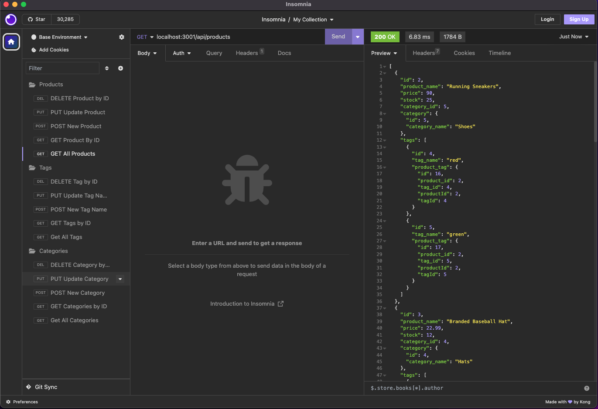
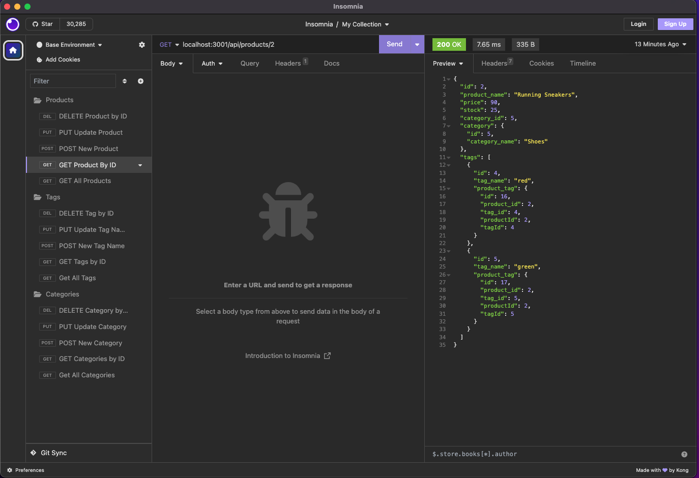
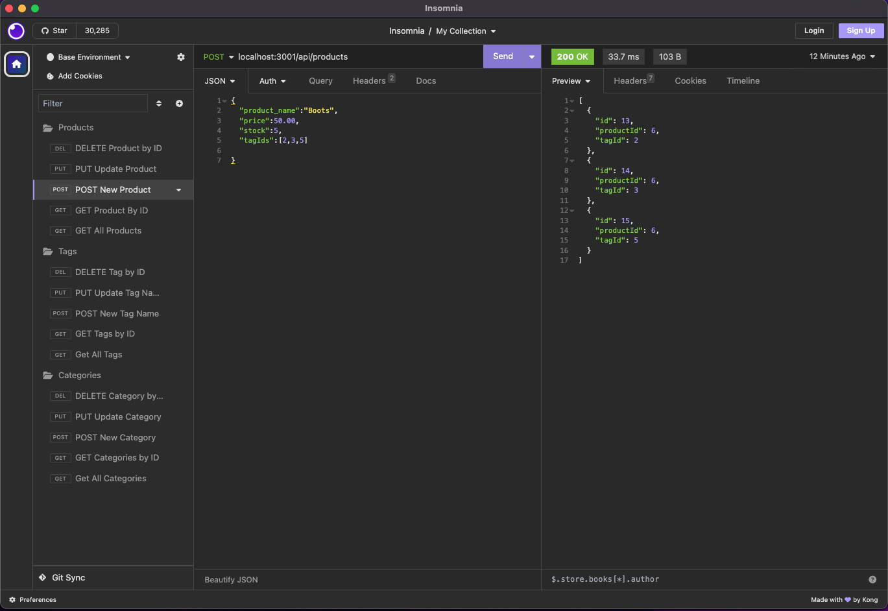
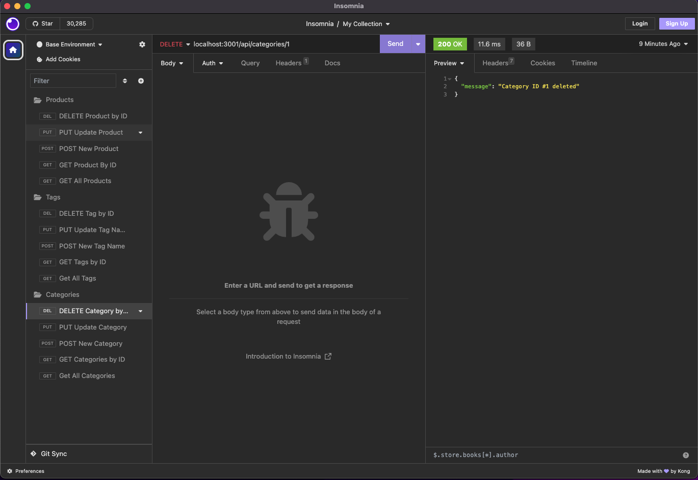
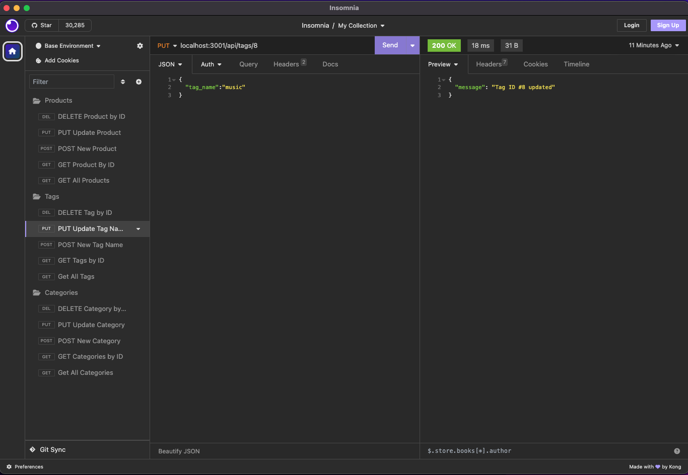

# Ecommerce Backend

## Description

This project is a small example of a typical ecommerce backend, where an ORM is used to control different models and their relationships to each other. This project used both One-To-Many and Many-To-Many relationships. Using HTTP requests, the user is able to get, delete, add, and update each of the models. 

## Installation

1. Use the MySQL shell to source schema.sql
2. In the Terminal, run npm run seed to fill the database with information
3. In the Terminal, run npm start to start the server
Walthrough video here: https://drive.google.com/file/d/1fqXFuQ-vz1G9rpXNsrcAdLD-QiWv7k-Z/view

## Usage

Once the server is running, you can interact with the database through HTTP requests with Insomnia.
For each model (Categories, Products, and Tags) the application supports the ability to:
* Get all instances of the model
* Get a specific instance of the model, by passing its id number in the URL
* Create a new instance of the model, by providing the necessary information in the body of the request
* Make an update to an existing model, by providing the necessary information in the body of the request
* Delete a specific instance of the model, by passing its id number in the URL

## Credits

N/A

## License

Please see the license in the repo.